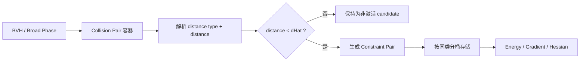

# IPC `Collision Pair -> Constraint Pair` 重构计划

## 1. 目标重述

这次重构的核心**不是**先强调 `VT / EE -> PP / PE / PT / EE` 的解析抽象，
而是先把整个 IPC 接触流程拆成两层：

- **Collision Pair**：broad phase / candidate phase 产生的碰撞对，表示“可能接近，需要检查”
- **Constraint Pair**：由 `Collision Pair` 在当前构型下解析、筛选后得到的**激活约束对**，表示“距离低于阈值，需要参与 barrier 装配”

你期待的流程可以明确写成：



**最终目标**：

1. broad phase 只负责生成 `Collision Pair`；
2. `Constraint Pair` 只保存当前激活约束；
3. 激活判定统一通过“解析距离类型 + 计算距离 + 阈值筛选”；
4. 同类 `Constraint Pair` 必须存放在一起，为未来 GPU kernel 并行执行减少线程分歧；
5. barrier 装配阶段尽量只面向分桶后的 `Constraint Pair`，而不是再回头分支判断 `VT / EE / Collider-VT`。


---

## 2. 当前问题

从现有代码看，当前 `ConstraintSet` 实际上混合了两层语义：

- 一方面它保存的是 broad phase 之后的候选对；
- 另一方面它们又直接承担 barrier 计算职责。

这种混合会带来几个实际问题：

### 2.1 candidate 和 active 没有明确分层

当前 `vtConstraints / eeConstraints / kinematicVTConstraints` 在名字上是“constraint”，
但它们本质上更像 **candidate collision pairs**。

因为真正是否要参与 barrier，取决于当前构型下的：

- `distanceType`
- `distanceSqr`
- 是否小于 `dHat^2`

也就是说，**现在缺少一个真正的 active constraint 层**。

### 2.2 激活筛选没有成为独立步骤

当前流程中：

- broad phase 找到 pair；
- pair 被直接塞进当前容器；
- 后续 barrier 路径直接遍历这些 pair。

这样做的问题是：

- “是否激活”与“pair 的存在”混在一起；
- 不方便在 `x` 更新后只重建 active set；
- 不方便统计和调试“有多少 candidate，多少 active”。

### 2.3 数据布局不利于未来 GPU 化

未来 GPU 并行时，最怕的是一个 kernel 里混入不同分支路径：

- 不同 primitive 类型；
- 不同 DOF 写入模式；
- 不同来源是否需要附带额外几何数据；
- 普通约束与 `Collider` 约束混跑。


如果 active constraint 仍按 `VT / EE / Collider-VT` 来源组织，那么后续 GPU kernel 中仍然要做很多条件判断，线程分歧会比较重。


---

## 3. 新模型：明确拆成两层

## 3.1 Collision Pair：表示“可能接近的候选对”

`Collision Pair` 的职责：

- 保存 broad phase 给出的拓扑配对；
- 持有解析所需的索引 / 几何引用；
- 在当前 `x` 下计算：
  - `distanceType`
  - `distanceSqr`
- 判断是否激活；
- 如果激活，则生成一个具体的 `Constraint Pair`。

### 推荐的 Collision Pair 分类

建议保留 3 类，与 broad phase 来源一致：

- `VertexTriangleCollisionPair`
- `EdgeEdgeCollisionPair`
- `ColliderVTCollisionPair`

它们是**拓扑候选层**，不直接代表 barrier 执行单元。

### Collision Pair 推荐字段

```cpp
enum class CollisionPairKind {
  VT,
  EE,
  ColliderVT,
};
```


每种 pair 至少包含：

- 拓扑索引（顶点 / 边 / 三角形）
- 当前构型引用 `x`
- 必要时的参考构型 `X`
- 当前最近特征 `distanceType`
- 当前距离 `distanceSqr`
- `isActive(dHat)` 或等价接口

对于 `EE` 来源的 pair，仍然需要能访问 `mollifier` 计算所需的参考几何；但第一版更推荐在 evaluate 阶段通过 pair 索引从外部状态回取，而不是在 pair 本身重复缓存一份字段。


---

## 3.2 Constraint Pair：表示“当前激活且可执行的约束单元”

`Constraint Pair` 的职责：

- 只表示**已经激活**的接触约束；
- 数据布局尽量贴近后续装配 / kernel 执行需要；
- 同类项集中存储；
- barrier `energy / gradient / hessian` 只消费它。

### 关键原则

**Constraint Pair 的类型本身应该统一。**

也就是说，不再定义 `PPConstraintPair / PEConstraintPair / PTConstraintPair / EEConstraintPair` 这类不同 class，
而是改成：

- 一个统一的 `ConstraintPair`
- 一个统一的 `ColliderConstraintPair`（是否保留单独类型，取决于单侧写回差异是否足够大）
- 两者共用同一个 `ConstraintKind`

建议：

```cpp
enum class ConstraintKind {
  PP,
  PE,
  PT,
  EE,
};
```

普通约束的 `ConstraintPair` 可以进一步收紧为最小表达，只需要保存：

- `ConstraintKind type`
- 一组定长 `indices[4]`，不同 `ConstraintKind` 约定各自使用前几个槽位

也就是说，从工程角度看，它本质上就是“**几个索引 + 一个类型**”。

对于 `PP / PE / PT / EE`，实际使用的索引个数都可以由 `type` 推导，不需要额外存 `indexCount`。  
对于 `EE` 来源约束，也不建议在 pair 内重复缓存 `restIndices` 或 `hasMollifierData`：只要 `type == ConstraintKind::EE`，就在执行 barrier 时通过 `indices` 回取 `mollifier` 计算所需的参考几何。

对于 `Collider` 参与的 active constraint，我这里建议**先保留一个单独的 `ColliderConstraintPair`**，原因不是命名偏好，而是：

- 它的 DOF 写回是单侧的；
- 需要携带 collider 几何；
- gradient / hessian scatter 形态与普通双侧约束不同。

因此“同类”不是简单指 `VT` 或 `EE`，而是指**同一种执行签名**；
但在实现上，完全没必要把不同 primitive 再拆成多个 pair class。


---

## 4. Constraint Pair 的建议组织方式

为了减少未来 GPU 上的线程分歧，同时避免过度拆 class，建议 active constraint 按**统一类型 + 类型区间**组织。

## 4.1 普通双侧约束

由 `VT` / `EE` 候选解析后得到的 active constraint，统一存为：

- `ConstraintPair`

其 `type` 取值为：

- `ConstraintKind::PP`
- `ConstraintKind::PE`
- `ConstraintKind::PT`
- `ConstraintKind::EE`

其中，来自 `EE` collision pair 的 active constraint 仍统一记为普通 `ConstraintPair`；当 `type == ConstraintKind::EE` 时，barrier 直接按 `indices` 进入 `mollifier` 路径，`mollifier` 不再单独作为一个 bucket、额外字段或可选分支。

## 4.2 `Collider` 单侧约束

由 `ColliderVTCollisionPair` 解析后得到的 active constraint，建议统一存为：

- `ColliderConstraintPair`

其 `type` 取值为：

- `ConstraintKind::PP`
- `ConstraintKind::PE`
- `ConstraintKind::PT`

之所以我这里仍建议和普通 `ConstraintPair` 分开，是因为：

- 写回 DOF 数量不同；
- Hessian / gradient 装配模式不同；
- GPU kernel 的访存与 scatter 模式不同。

也就是说，**类型统一，不等于所有 active pair 必须塞进同一个 struct**；
这里更合理的做法是：

- 普通双侧约束统一成一个 `ConstraintPair`
- `Collider` 单侧约束统一成一个 `ColliderConstraintPair`

然后在各自容器内部，再按 `ConstraintKind` 聚合和分区。


---

## 5. 两层之间的映射关系

## 5.1 `VertexTriangleCollisionPair`

当前构型下先解析 `PointTriangleDistanceType`，再映射到普通 active `ConstraintPair`：

- `P_A / P_B / P_C -> ConstraintKind::PP`
- `P_AB / P_BC / P_CA -> ConstraintKind::PE`
- `P_ABC -> ConstraintKind::PT`

如果 `distanceSqr >= dHat^2`，则**不生成任何 active constraint**。

## 5.2 `EdgeEdgeCollisionPair`

当前构型下先解析 `EdgeEdgeDistanceType`，再映射到普通 active `ConstraintPair`：

- `A_C / A_D / B_C / B_D -> ConstraintKind::PP`
- `AB_C / AB_D / A_CD / B_CD -> ConstraintKind::PE`
- `AB_CD -> ConstraintKind::EE`

无论最终落到 `PP / PE / EE` 的哪一种 active constraint，只要来源是 `EE` collision pair，就保留进入 `mollifier` 路径所需的信息；第一版推荐仅通过 `type + indices` 在执行时回取，不在 pair 里重复存一份。

同样，只有 `distanceSqr < dHat^2` 时才激活。


## 5.3 `ColliderVTCollisionPair`

当前构型下解析 `PointTriangleDistanceType`，再映射为 `ColliderConstraintPair`：

- `P_A / P_B / P_C -> ConstraintKind::PP`
- `P_AB / P_BC / P_CA -> ConstraintKind::PE`
- `P_ABC -> ConstraintKind::PT`

只对系统可写这一侧的顶点 DOF 写回。


---

## 6. 容器设计建议

## 6.1 Collision Pair 容器

```cpp
struct CollisionPairSet {
  std::vector<VertexTriangleCollisionPair> vtPairs;
  std::vector<EdgeEdgeCollisionPair> eePairs;
  std::vector<ColliderVTCollisionPair> colliderVTPairs;

  void clear();
};
```


这里存的是 broad phase 候选。

## 6.2 Constraint Pair 容器

```cpp
struct ConstraintPair {
  ConstraintKind type;
  int indices[4];
};

struct ColliderConstraintPair {
  ConstraintKind type;
  int writableIndices[1];
  int colliderIndices[3];
};

struct ConstraintPairSet {
  std::vector<ConstraintPair> pairs;
  std::vector<ColliderConstraintPair> colliderPairs;

  std::array<int, 5> typeOffsets;
  std::array<int, 4> colliderTypeOffsets;

  void clear();
};
```

### 为什么推荐这种设计

因为这样可以直接做到：

- 普通 `ConstraintPair` 真正收紧到 `type + indices[4]`；
- `indexCount` 可以由 `type` 推导，`EE` 的 `mollifier` 输入也通过 `indices` 回取；
- `ColliderConstraintPair` 只在单侧写回差异明显时单独保留；
- 容器层只保留两个主数组，而不是一堆 `PP/PE/PT/EE` 小数组；
- 每个主数组内部再通过 `typeOffsets` 维护各类型区间；
- 后续 GPU 化时，可以按区间遍历，也可以按需要合并 launch。

`type` 进一步编码进 `indices` 的正负或布局，确实可以作为更激进的压缩方向；
但我不建议把它作为第一版 baseline，因为这会明显抬高调试、验证和统计阶段的心智负担。


---

## 7. 推荐执行流程

## 7.1 broad phase：只构建 `Collision Pair`

`precomputeCollisionPairs(config)` 的职责：

- 用 BVH / trajectory bbox 找到候选配对；
- 只构建 `CollisionPairSet`；
- 不在这个阶段直接保留 active constraint。

也就是把现在的：

- `computeVertexTriangleConstraints()`
- `computeEdgeEdgeConstraints()`
- `computeKinematicVTConstraints()`

重命名 / 重构为：

- `computeVertexTriangleCollisionPairs()`
- `computeEdgeEdgeCollisionPairs()`
- `computeColliderVTCollisionPairs()`


### 这一层只负责“找候选”

不负责最终 barrier 执行形态。

---

## 7.2 activation pass：由 `Collision Pair` 生成 `Constraint Pair`

新增独立步骤：

```cpp
void rebuildConstraintPairsFromCollisionPairs(Real dHat);
```

它的逻辑：

1. 第一遍并行遍历所有 `Collision Pair`；
2. 在当前 `x` 下更新：
   - `distanceType`
   - `distanceSqr`
3. 对激活 pair 先统计：
   - 普通 `ConstraintPair` 各 `ConstraintKind` 的数量
   - `ColliderConstraintPair` 各 `ConstraintKind` 的数量
4. 对统计结果做 prefix sum，得到各类型在统一容器中的区间和总 active 数；
5. 根据总数检查 `ConstraintPairSet` 存储：
   - 容量不足时扩容
   - 容量足够时直接覆写已有空间
6. 第二遍并行写入：
   - 普通 active pair 写入 `pairs` 对应区间
   - `Collider` active pair 写入 `colliderPairs` 对应区间
7. 非激活 pair 直接跳过，不进入 active 容器。


### 这个步骤是整个重构的核心

因为它明确把：

- **candidate existence**
- **active constraint activation**

分开了。

---

## 7.3 Newton / line search 中的更新逻辑

当前 `x` 改变后，不应只更新 `type`，而应：

1. 更新 `Collision Pair` 的距离类型与距离；
2. 重新构建 active `ConstraintPairSet`。

也就是说，当前的：

```cpp
updateConstraintStatus()
```

应演变为类似：

```cpp
updateCollisionPairStatus();
rebuildConstraintPairsFromCollisionPairs(config.dHat);
```

或者直接合并成：

```cpp
refreshActiveConstraintPairs(config.dHat);
```

### 这样做的意义

- `Collision Pair` 是稳定的候选层；
- `Constraint Pair` 是随 `x` 变化的 active 层；
- 非常符合 line search / Newton 过程中“激活集变化”的实际需求。

---

## 8. barrier 装配层如何改

重构后，`energy / gradient / hessian` 不再直接遍历 broad phase 候选，
而是直接遍历 `ConstraintPairSet` 中的统一容器：

- `pairs`
- `colliderPairs`

遍历方式也不再是“一个类型一个 class / 一个 vector”，而是：

- 按 `typeOffsets` 遍历 `pairs` 内各 `ConstraintKind` 区间；
- 按 `colliderTypeOffsets` 遍历 `colliderPairs` 内各 `ConstraintKind` 区间。

### 预期收益

- barrier 热路径不再混合 candidate 判断；
- `ConstraintPair` 类型统一，数据访问更规整；
- 更接近未来 GPU kernel 组织方式；
- 更容易做统计：
  - `numCollisionPairs`
  - `numActiveConstraintPairs`
  - `numActiveColliderConstraintPairs`
  - 每种 `ConstraintKind` 的区间大小


---

## 9. 对 GPU 友好的进一步要求

本次 plan 的核心诉求之一，是让数据布局自然过渡到 GPU。

因此建议从一开始就遵守下面两个原则。

## 9.1 统一类型 + 类型区间，比按来源拓扑分桶更合适

也就是：

- 不要只按 `VT / EE / ColliderVT` 存 active constraints；
- 也不要再为 `PP / PE / PT / EE` 分别定义不同 pair class；
- 而要用统一 `ConstraintPair` / `ColliderConstraintPair`，再按 `ConstraintKind` 聚合出连续区间。

这样后续 GPU launch 才能做到：

- 同一批线程走相近的数学路径；
- 同一批线程写相同形状的 DOF；
- 最大程度降低 warp divergence；
- 同时保持数据结构本身足够简单。


## 9.2 先用 CPU 友好的 AoS，后续再替换为 GPU 友好的 SoA

后续如果上 GPU，可进一步演进为：

- SoA buffer
- packed index arrays
- separate geometry arrays
- precomputed scatter maps

但这一步可以放在后续，不必在第一次重构里一起做。

---

## 10. 分阶段实施方案

## Phase 1：先把命名和容器语义理顺

### 目标

先把“当前叫 constraint 的其实是 collision pair”这个问题理顺。

### 修改建议

- 将现有 broad-phase 产物从语义上改名为 `Collision Pair`；
- 引入 `CollisionPairSet` 与 `ConstraintPairSet` 两个容器；
- `IpcIntegrator` 同时持有：
  - `collisionPairs`
  - `constraintPairs`

### 本阶段不做的事

- 不改 barrier 数学公式；
- 不改具体 GIPC kernel；
- 不强行做 SoA；
- 不做 GPU 代码。

---

## Phase 2：实现 activation pass

### 目标

让 `Constraint Pair` 真正由 `Collision Pair` 筛选生成。

### 修改建议

给每种 `Collision Pair` 增加接口，例如：

```cpp
void updateDistanceState();
bool isActive(Real dHat) const;
void appendConstraintPair(ConstraintPairSet& out, Real dHat) const;
```

然后统一新增：

```cpp
void rebuildConstraintPairsFromCollisionPairs(Real dHat);
```

### 本阶段完成后的状态

- broad phase -> `CollisionPairSet`
- activation pass -> 统一的 `ConstraintPairSet`
- active 数据布局变为：统一 pair 类型 + 类型区间
- barrier 装配仍可逐步迁移


---

## Phase 3：让 barrier 装配完全切到 `ConstraintPairSet`

### 目标

`barrierEnergy()` / `barrierEnergyGradient()` / `spdProjectHessian()`
彻底不再关心 broad phase 来源容器。

### 修改建议

- energy：按统一容器中的类型区间遍历；
- gradient：按统一容器中的类型区间遍历；
- hessian：按统一容器中的类型区间遍历；
- `describe...()` 调试信息改为输出：
  - `ConstraintKind`
  - 是否来自 `Collider`
  - touched blocks
  - 是否走 `EE mollifier` 路径

### 本阶段收益

此时热路径已切到统一 active 容器，后续 GPU 改造路径会清晰很多。


---

## Phase 4：针对 GPU 进一步收紧 bucket 粒度

### 目标

为未来 GPU kernel 做最后的数据布局准备。

### 可选优化

- 分别统计 `ConstraintKind::PP / PE / PT / EE` 的区间大小；
- 单独统计 `EE` 来源约束，用于观察 `EE mollifier` 路径的比例与代价；
- 单独统计 `ColliderConstraintPair` 中 `PP / PE / PT` 的区间大小；

- 必要时进一步把：
  - 普通 `ConstraintPair` 中的 `PE` from VT
  - 普通 `ConstraintPair` 中的 `PE` from EE

  再拆开，如果它们最终 kernel 访存 / 写回模式仍不完全一致。


### 说明

这一步是否需要继续细分，不应靠抽象偏好决定，
而应由未来 GPU kernel 的实际分歧情况决定。

---

## 11. 文件级改动建议

## 11.1 推荐新增文件

- `FEM/include/fem/ipc/collision-pair.h`
- `FEM/src/ipc/collision-pair.cc`

这里放 broad phase 候选层的数据结构和激活逻辑。

## 11.2 现有文件的职责调整

- `FEM/include/fem/ipc/constraint.h`
  - 调整为只放统一 `ConstraintPair` / `ColliderConstraintPair` 定义和 barrier 接口
- `FEM/src/ipc/constraint.cc`
  - 调整为只放统一 active pair 的 energy / gradient / hessian 装配
- `FEM/include/fem/ipc/integrator.h`
  - `ConstraintSet` 改为两层容器
- `FEM/src/ipc/integrator.cc`
  - broad phase 构建 `CollisionPairSet`
  - activation pass 构建 `ConstraintPairSet`
  - barrier 遍历统一 active 容器与类型区间


### 如果你想减少文件移动

也可以先不拆新文件，而是在现有 `constraint.h/.cc` 内先分成两块：

- `Collision Pair`
- `Constraint Pair`

等结构稳定后，再拆成独立文件。

---

## 12. 测试建议

## 12.1 candidate -> active 筛选测试

验证：

- 候选 pair 存在，但距离大于阈值时，不应进入 active 容器；
- 距离小于阈值时，应进入对应统一 pair 容器与类型区间；
- `VT / EE / ColliderVT` 都要覆盖。


## 12.2 映射测试

验证：

- `VT` 候选能正确落到统一 `ConstraintPair`，且 `type` 分别为 `PP / PE / PT`；
- `EE` 候选能正确落到统一 `ConstraintPair`，且 `type` 分别为 `PP / PE / EE`，并且 `type == EE` 时能正确进入 `mollifier` 路径；
- `ColliderVT` 候选能正确落到统一 `ColliderConstraintPair`，且 `type` 分别为 `PP / PE / PT`。


## 12.3 `x` 更新导致 active set 变化

验证同一个 `Collision Pair`：

- 在构型 A 下不激活；
- 在构型 B 下激活；
- 或者在不同构型下落入不同 `ConstraintKind` 区间。


这类测试非常关键，因为它正是 `Collision Pair -> Constraint Pair` 两层分离的意义所在。

## 12.4 barrier 数值回归

确保重构后：

- energy 不变；
- gradient 与 FD 一致；
- Hessian 行为不退化；
- `EE` 来源约束的 `mollifier` 行为不变。


## 12.5 类型区间统计测试

增加简单统计验证，确保统一容器中的计数和区间符合预期，例如：

- `numCollisionVTPairs`
- `numActiveConstraintPairs`
- `numActiveColliderConstraintPairs`
- `numActiveEeSourcePairs`
- `numPPConstraints`
- `numColliderPEConstraints`

这对后续 GPU profiling 很有帮助。


---

## 13. 风险点

## 13.1 最大风险

最大的风险不是数学公式本身，而是**激活后生成的 Constraint Pair 和实际 kernel 输入不一致**。

尤其要小心：

- local primitive 索引到 global block 的映射；
- `EE` 来源约束是否能仅通过 `type + indices` 正确恢复 `mollifier` 路径输入；
- `Collider` 单侧写回；
- `x` 更新后 active set 重建是否完整。


## 13.2 防护措施

- 先分层，再迁移热路径；
- 先保留 AoS，别一开始就上 SoA；
- 统一 `ConstraintPair` / `ColliderConstraintPair` 后再做单测；
- 先用 CPU 数值回归把行为钉住，再谈 GPU。


---

## 14. 验收标准

完成后应满足：

1. broad phase 产物被清晰定义为 `Collision Pair`；
2. active 约束被清晰定义为统一的 `Constraint Pair`；
3. `Constraint Pair` 由 `Collision Pair` 在当前 `x` 下解析得出；
4. 只有 `distance < dHat` 的 pair 才会进入 active 容器；
5. `PP / PE / PT / EE` 不再拆成不同 pair class，而是统一由 `ConstraintKind` 区分；
6. 若保留 `ColliderConstraintPair`，它也应是统一类型结构，而不是 `ColliderPP / ColliderPE / ColliderPT` 三个 class；
7. barrier 装配主路径只遍历 `ConstraintPairSet` 的统一容器与类型区间；
8. 数值结果与当前实现保持一致；
9. 容器布局对后续 GPU 并行是直接可用或低成本可演进的。


---

## 15. 建议实施顺序

1. 把当前 broad phase 产物正式改名为 `Collision Pair`；
2. 新增统一 `ConstraintPairSet`；
3. 增加 activation pass：`Collision Pair -> ConstraintPair`；
4. 先让 `barrierEnergy()` 切到统一容器 + 类型区间；
5. 再让 gradient / hessian 切到统一容器 + 类型区间；
6. 补齐 candidate / active / 区间统计测试；
7. 最后再评估是否把统一 active 容器从 AoS 演进到 SoA。


---

## 16. 结论

这次 plan 应该明确围绕你要的主线来做：

- **先有 `Collision Pair`**：表示 broad phase 候选；
- **再生成统一的 `ConstraintPair` / `ColliderConstraintPair`**：表示当前激活约束；
- **通过 `ConstraintKind` 区间聚合 active set**：为未来 GPU 并行减少线程分歧；
- **barrier 热路径只消费统一 active 容器**。

这比单纯讨论 `VT / EE / primitive` 的抽象分层更贴近你要的工程目标，也更适合作为后续 GPU 化的前置重构方案。

